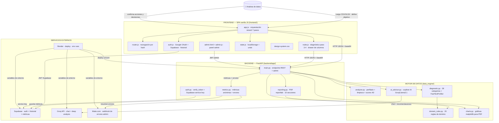
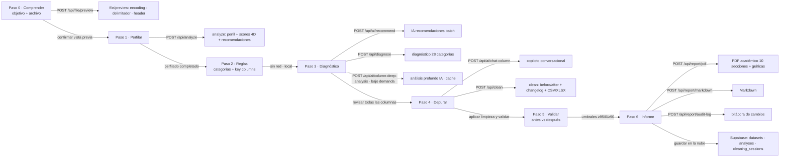
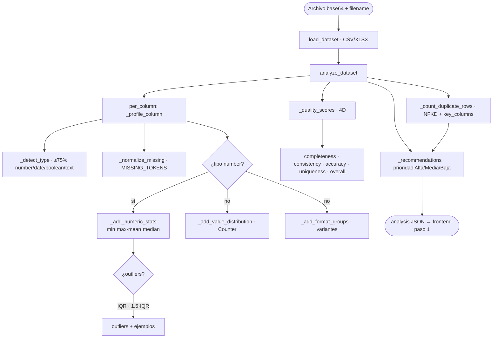
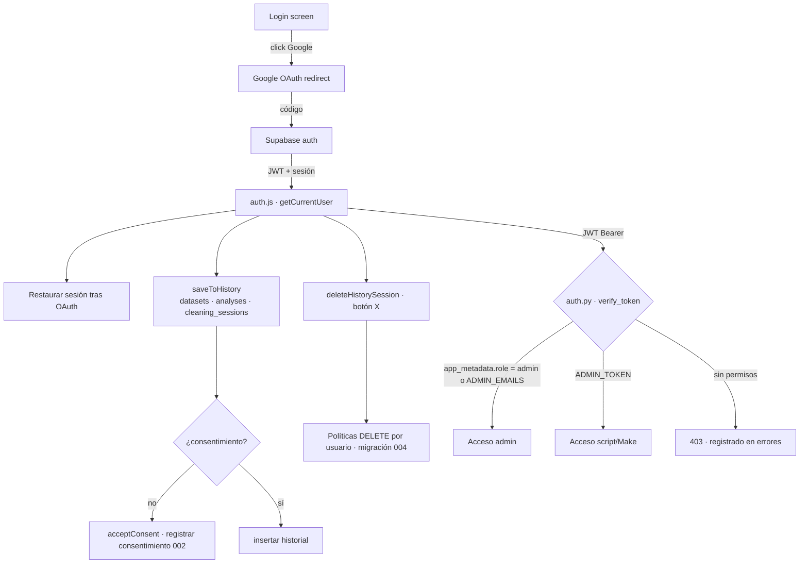
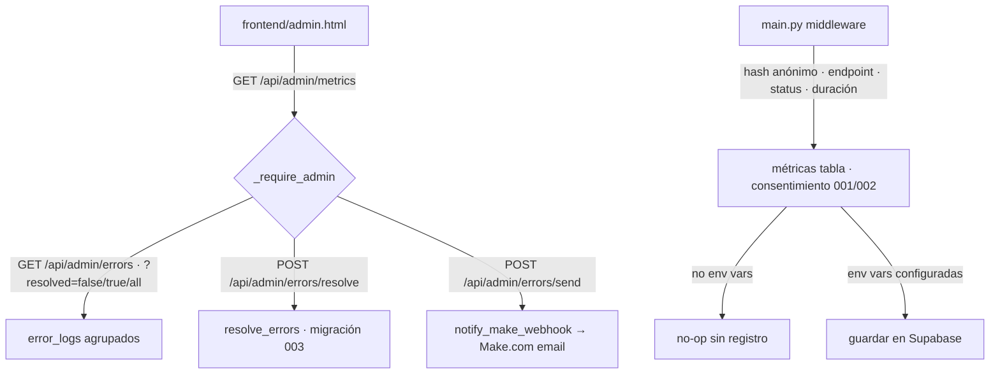
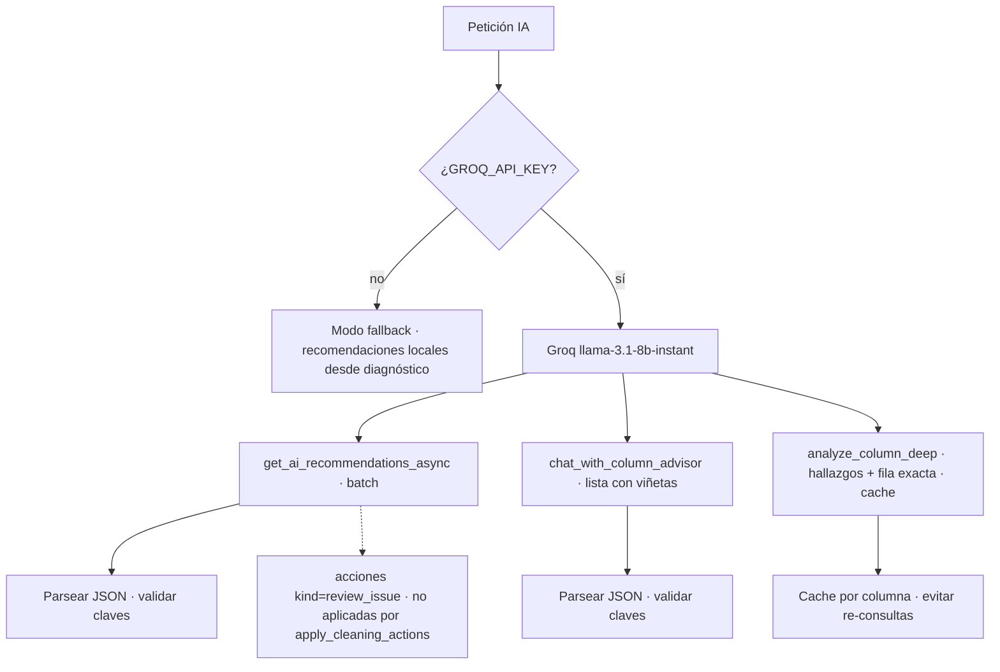

# Flujograma Universal — AuditData AI

Diagrama canónico e integral del proyecto. Cubre: frontend, backend, motor de datos, IA, conexiones externas (Supabase, Groq, Make.com, Render), autenticación, historial en la nube, métricas anónimas y panel admin.

- Repo: https://github.com/Davidcastanom/auditdata-ai.git
- Deploy: https://auditdata-ai-1.onrender.com
- Documentos complementarios: `docs/ARQUITECTURA_Y_FLUJO.md` · `docs/MAPEO_ANALISIS_ESTADISTICO.md`

---

## 1. Diagrama universal (Mermaid)



---

## 2. Flujo del wizard — 7 etapas (0-6) con endpoints



---

## 3. Procesamiento interno del motor (analyzer.py)



---

## 4. Autenticación y nube (auth.js + auth.py)



---

## 5. Panel admin y métricas anónimas (metrics.py)



---

## 6. Flujo IA (ai_advisor.py + Groq)



---

## 7. Versión ASCII (para generar imagen con IA)

```
                        ┌───────────────────────────────────────────────┐
    USUARIO ───────────▶│   FRONTEND (SPA vanilla JS)                  │
                        │  app.js · nube.js · auth.js · router.js      │
                        │  state.js · design-system.css · admin.js     │
                        └───────────────┬───────────────────────────────┘
                                        │ HTTP JSON + base64
                    ┌───────────────────▼───────────────────────────────┐
                    │   BACKEND (FastAPI)   backend/app/                │
                    │  main.py · reporting.py · metrics.py · auth.py    │
                    └───────────────────┬───────────────────────────────┘
                                        │
                    ┌───────────────────▼───────────────────────────────┐
                    │   MOTOR DE DATOS   data_engine/                   │
                    │  analyzer.py ── perfilado + limpieza + scores 4D   │
                    │  diagnostic.py ── 28 categorías + FastTextProfiler │
                    │  domain_rules.py ── 20 reglas de dominio           │
                    │  charts.py ── gráficas matplotlib (PDF)           │
                    │  ai_advisor.py ── copiloto IA                      │
                    └───┬───────────┬───────────────┬──────────┬────────┘
                        │           │               │          │
                   ┌────▼───┐  ┌────▼────┐   ┌──────▼────┐ ┌────▼─────┐
                   │Supabase│  │  Groq   │   │  Make.com │ │  Render  │
                   │auth+hist│  │LLaMA3.1│   │webhook err│ │  deploy  │
                   │métricas │  └─────────┘   └───────────┘ └──────────┘
                   └────────┘
```

---

## 8. Inventario universal de flujos

| Flujo | Origen → Destino | Archivos clave | Estado |
|---|---|---|---|
| Wizard 7 pasos | app.js → endpoints `/api/*` | `frontend/src/app.js` · `backend/app/main.py` | Activo |
| Perfilado estadístico | `/api/analyze` → analyzer.py → UI paso 1 | `data_engine/analyzer.py` | Activo |
| Diagnóstico 28 categorías | `/api/diagnose` + nube.js → UI paso 3 | `data_engine/diagnostic.py` · `domain_rules.py` | Activo |
| Limpieza | `/api/clean` → apply_cleaning_actions → XLSX/CSV | `analyzer.py` · `csv_to_xlsx` | Activo (bug XLSX corregido `c9965ae`) |
| IA copiloto | `/api/ai/*` → Groq → chat/deep | `data_engine/ai_advisor.py` | Activo (fallback sin key) |
| Informes | `/api/report/pdf` · `markdown` · `audit-log` | `reporting.py` · `charts.py` | Activo |
| Autenticación | Google OAuth → Supabase → JWT | `auth.js` · `auth.py` | Activo |
| Historial en la nube | saveToHistory / getHistory / deleteHistorySession | `auth.js` · migraciones 001-004 | Activo (botón X listo para deploy) |
| Métricas anónimas | middleware → tabla metrics (con consentimiento) | `metrics.py` · migraciones 001/002 | Activo · requiere env vars en Render |
| Errores admin | error_logs → agrupación → resolve/send | `metrics.py` · migración 003 | Activo · botón resolver `f55da04` |
| Deploy | GitHub `main` → Render auto-deploy | `render.yaml` · `Procfile` · `Dockerfile` | Activo |

---

## 9. Leyenda de conexiones externas

| Servicio | Protocolo | Secretos | Uso |
|---|---|---|---|
| **Supabase** | REST/HTTPS (anónimo JWT + service key) | `SUPABASE_URL`, `SUPABASE_ANON_KEY`, `SUPABASE_SERVICE_KEY` | Auth, historial, métricas |
| **Groq** | HTTPS (API key) | `GROQ_API_KEY`, `Recomendaciones_de_copiloto` | IA chat/deep/recomendaciones |
| **Make.com** | HTTPS (webhook) | URL de webhook | Notificación de errores admin |
| **Render** | HTTPS | env vars del dashboard | Host de la API + frontend estático |

---

# Anexo A — Flujograma para personas no técnicas

*Sección pensada para stakeholders, clientes o analistas sin conocimientos de programación. Explica qué hace la herramienta y en qué orden, sin mencionar código, servidores ni tecnologías.*

## ¿Qué hace AuditData AI en una frase?

Toma un archivo de datos (como una hoja de Excel), **lo examina**, **detecta errores**, te **ayuda a corregirlos con la guía de una inteligencia artificial**, y al final **te entrega un informe profesional** de todo lo que encontró y lo que se hizo.

## El recorrido del analista, de principio a fin

```mermaid
flowchart TD
    A[1️⃣ Me subo mi archivo de datos<br/>e indico para qué lo voy a usar] --> B[2️⃣ La herramienta lo revisa sola<br/>y me muestra un "chequeo médico"<br/>de cada columna]
    B --> C[3️⃣ Me explica qué reglas aplicar<br/>y deja que yo decida]
    C --> D[4️⃣ Detecta problemas típicos<br/>faltantes · repetidos · errores de escritura<br/>valores raros · formatos mezclados]
    D --> E[5️⃣ Me propone soluciones y converso<br/>con el asistente de IA si tengo dudas]
    E --> F[6️⃣ Aplico las correcciones que elijo<br/>y veo el antes vs el después]
    F --> G[7️⃣ Reviso que el dato quedó listo]
    G --> H[8️⃣ Descargo el informe + el archivo limpio]
    H --> I[🏁 Dato listo para analizar<br/>con decisiones documentadas]
```

## Explicación paso a paso (sin tecnicismos)

| Paso | Qué hace | En palabras simples |
|---|---|---|
| **1. Comprender** | Cargas tu archivo (CSV/Excel) y escribes el objetivo del análisis | "Dime qué quieres lograr y muéstrame tu archivo." |
| **2. Perfilar** | La herramienta examina cada columna automáticamente | Es como un médico que toma signos vitales: cuántas filas, cuántas columnas, qué tipo de dato hay, cuántos faltantes. |
| **3. Reglas** | Defines qué columnas se comparan para encontrar repetidos | "Para detectar duplicados, ¿comparamos todo o solo ciertos campos?" |
| **4. Diagnóstico** | Detecta 28 tipos de problemas con la guía de una IA | Señala con luz roja/amarilla/verde cada problema y te da una recomendación en lenguaje claro. |
| **5. Depurar** | Conversas con el asistente de IA y aplicas correcciones | Puedes preguntar "¿qué hago con esta columna?" y luego decides si aceptas la sugerencia. |
| **6. Validar** | Comparas el archivo antes y después | Tablero tipo semáforo: cada dimensión de calidad pasa de rojo a verde. |
| **7. Informe** | Generas el reporte final | Un PDF profesional (también Markdown y bitácora) con todo documentado, ideal para presentar o auditar. |

## ¿Qué problemas detecta la herramienta? (en lenguaje humano)

- ✅ Celdas vacías donde debería haber un dato
- ✅ Filas repetidas (duplicadas)
- ✅ Fechas escritas en formatos diferentes dentro de la misma columna
- ✅ Mayúsculas y minúsculas inconsistentes ("bogota" vs "Bogotá")
- ✅ Valores imposibles o fuera de rango (una edad de 450 años)
- ✅ Números extremos que pueden ser errores de captura
- ✅ Palabras mal escritas o con caracteres raros
- ✅ Mezclas de idiomas o unidades dentro de una misma columna

## Conceptos clave en una frase

| Término técnico | Explicación simple |
|---|---|
| **Calidad de datos** | Qué tan confiable y completa está tu información para tomar decisiones |
| **Outlier** | Un valor que se sale mucho del resto y podría ser un error |
| **Faltante (missing)** | Un dato que no se llenó y deja la celda vacía |
| **Duplicado** | Una fila que repite otra ya existente |
| **Imputar** | Rellenar un valor faltante (con el promedio, la mediana o el más frecuente) |
| **Bitácora** | El registro de cada decisión que se tomó y por qué — trazabilidad total |
| **Copiloto IA** | Un asistente que te guía conversando, pero **la última palabra siempre es tuya** |
| **Informe PDF** | El documento final de 10 secciones que resume diagnóstico, acciones y resultados |

## Lo que la herramienta NO hace

- ❌ No inventa datos que no existen
- ❌ No decide por ti: cada corrección requiere tu confirmación
- ❌ No expone ni comparte tu información (todo queda documentado solo para tu proyecto, y las métricas de uso son anónimas y opcionales)

## Resumen visual en una imagen

```
 SUBIR ─▶ REVISAR ─▶ REGLAS ─▶ DIAGNÓSTICO ─▶ CORREGIR ─▶ VALIDAR ─▶ INFORME
 archivo    chequeo     cómo       problemas     con IA      antes vs     PDF +
            médico      comparar   + consejos    y tu ok     después      archivo limpio
```

**En una palabra:** *AuditData AI es tu asistente para dejar tu base de datos limpia, documentada y lista para analizar.*
